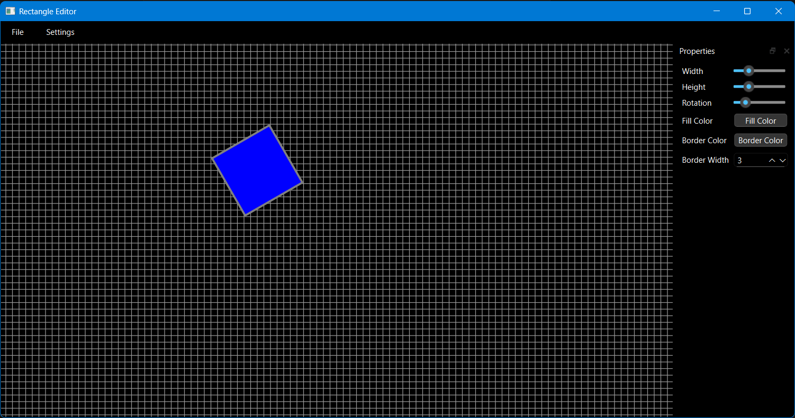

# Shape Editors
Collection of shape editor tools for rectangle, ellipse, triangle, line, text, and image

## Rectangle Editor

Features:
- File Menu
    - New
    - Open
    - Save
    - Print
    - Exit
- Settings Menu
    - Toggle Grid
    - Toggle Theme
    - Set Rotation Snap
- Shape Appearance
    - Move
    - Resize Width
    - Resize Height
    - Rotate
    - Fill Color
    - Border Color
    - Border Width

## Ellipse Editor

Same features as the Rectangle Editor

